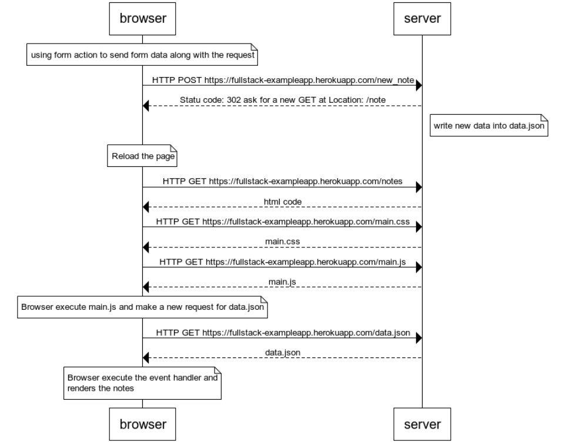
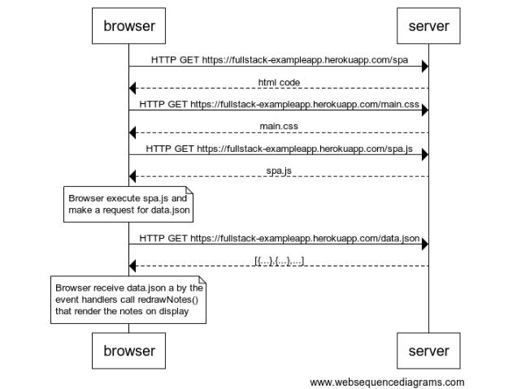
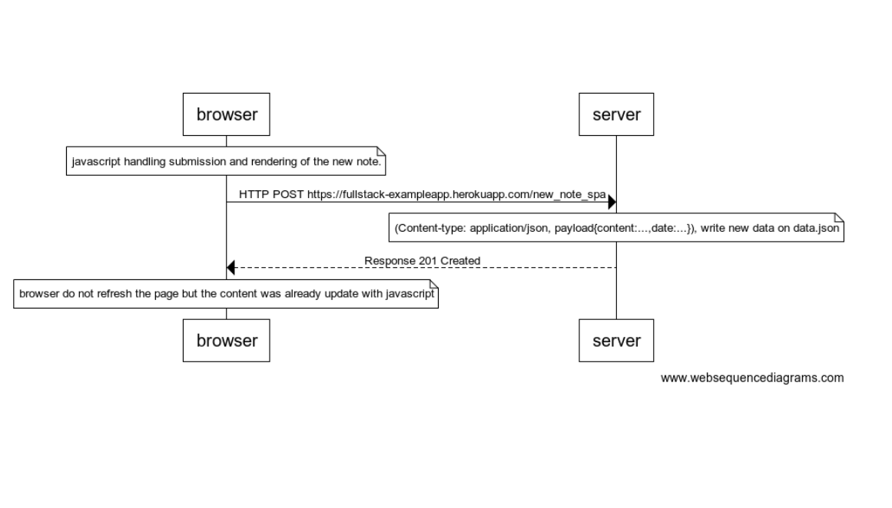

# submission 0.4: new note

```
note over browser:
using form action to send form data along with the request
end note

browser->server: HTTP POST https://fullstack-exampleapp.herokuapp.com/new_note
server-->browser: Statu code: 302 ask for a new GET at Location: /note

note right of server:
write new data into data.json
end note

note over browser:
Reload the page
end note

browser->server: HTTP GET https://fullstack-exampleapp.herokuapp.com/notes
server-->browser: html code
browser->server: HTTP GET https://fullstack-exampleapp.herokuapp.com/main.css
server-->browser: main.css
browser->server: HTTP GET https://fullstack-exampleapp.herokuapp.com/main.js
server-->browser: main.js
note over browser
Browser execute main.js and make a new request for data.json
end note
browser->server: HTTP GET https://fullstack-exampleapp.herokuapp.com/data.json
server-->browser: data.json

note over browser:
Browser execute the event handler and
renders the notes
end note
```





# submission 0.5: spa

```session
server-->browser: html code
browser->server: HTTP GET https://fullstack-exampleapp.herokuapp.com/main.css
server-->browser: main.css
browser->server: HTTP GET https://fullstack-exampleapp.herokuapp.com/spa.js
server-->browser: spa.js

note over browser:
Browser execute spa.js and
make a request for data.json
end note

browser->server: HTTP GET https://fullstack-exampleapp.herokuapp.com/data.json
server-->browser: [{...},{...},...]

note over browser:
Browser receive data.json a by the
event handlers call redrawNotes()
that render the notes on display
end note
```



# 0.6: New note

```note over browser:
note over browser
javascript handling submission and rendering of the new note.
end note

browser->server: HTTP POST https://fullstack-exampleapp.herokuapp.com/new_note_spa

note over server:
(Content-type: application/json, payload{content:...,date:...}),
write new data on data.json 
end note

server-->browser: Response 201 Created

note over browser:
browser do not refresh the page
but the content was already update with javascript
end note
```



